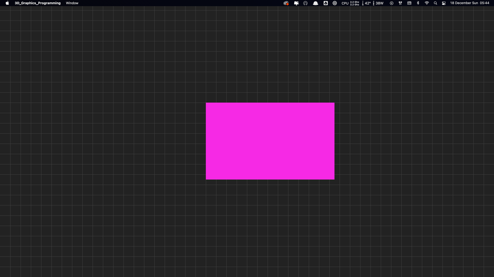
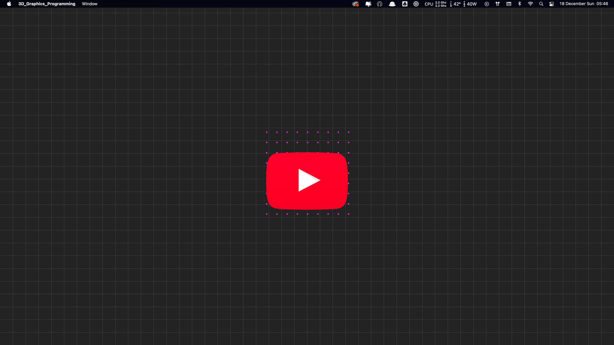
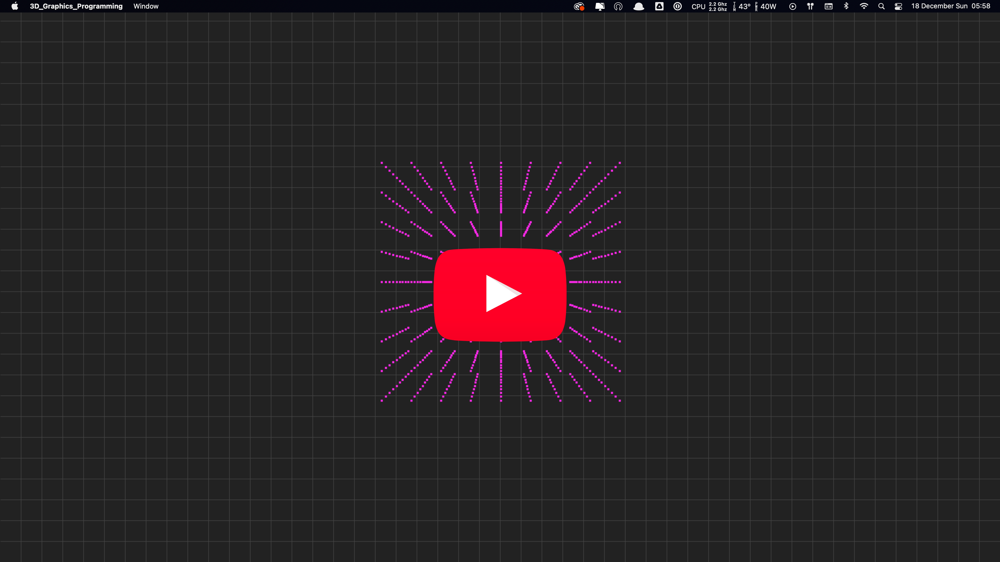
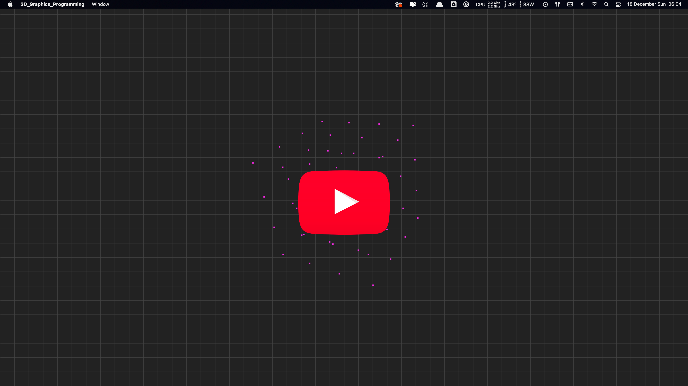
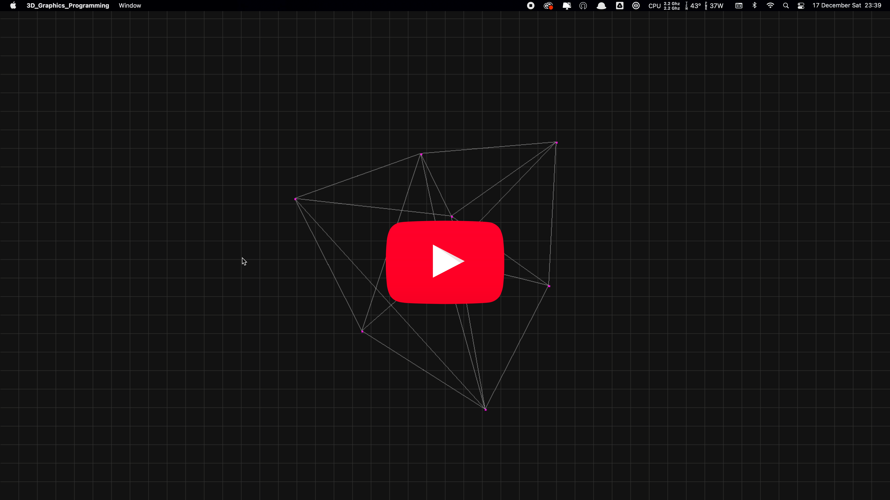
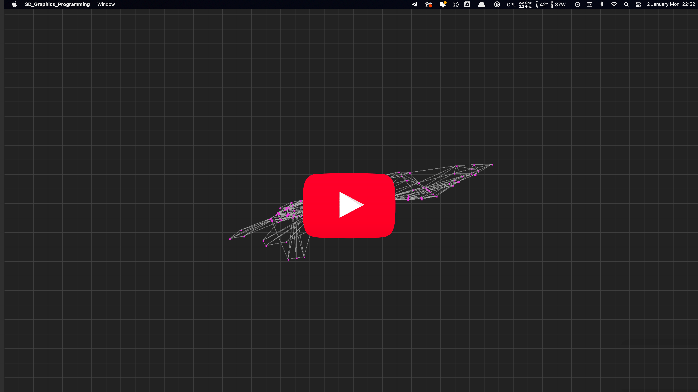
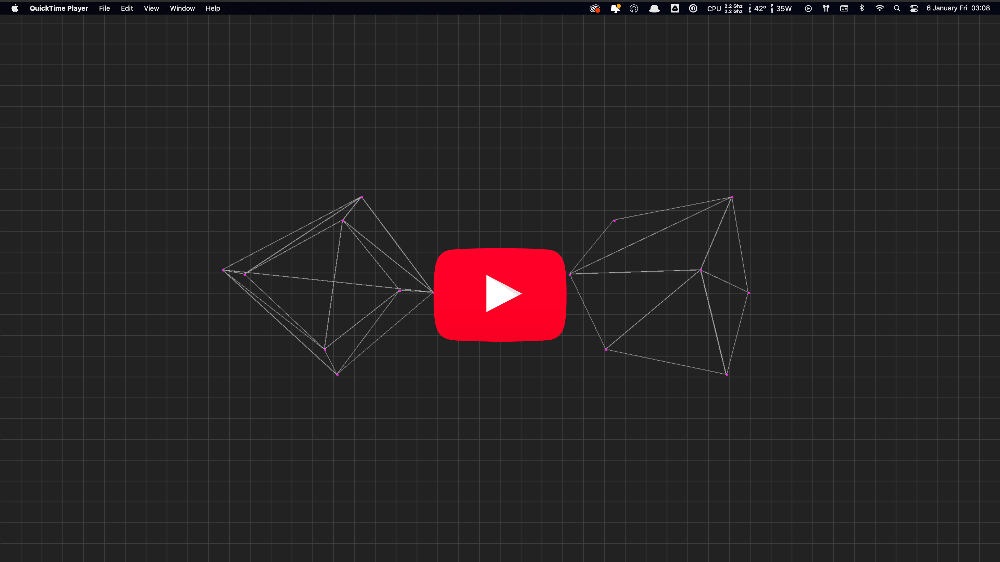
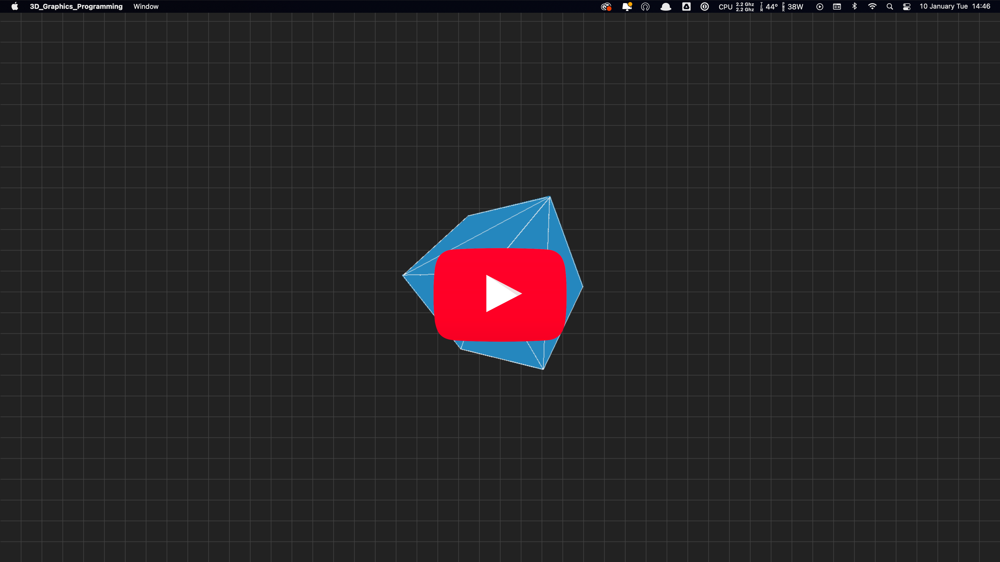

# 3D Graphics Programming Study

This is my studying repository about 3D Computer Graphics Programming.

---

## My Progress

### 1. Draw Grid and Filled Cube

In this step, I learned the basics of how to draw pixel to the screen by using SDL2 library. I understand what the pixel/color buffer is.

 
---
### 2. Point Cloud Cube with Orthographic Projection

In this step, I learned what the orthographic projection is and how to draw a 3D point cloud cube. With an extra effort I implemented basic transform animation :)

 
---

### 3. Point Cloud Cube with Perspective Projection

In this step, I learned what the perspective projection is and implemented it to the previously created point cloud cube.

 
---

### 4. Rotating Points in 3D Space

In this step, I learned how to rotate a point by using the basic trigonometry formulas. Then I rotate the entire mesh with an animation.

 
---

### 5. Triangulated Wireframe Box

In this step, I learned how to draw a line between two points. Then, I refactored my box mesh code to re-structure it as a triangulated mesh. After that, I rendered the triangulated mesh by using the new draw line method that I learned.

 
---

### 6. Loading .OBJ Files

In this step, I learned how to read and parse .OBJ files. Then, I loaded a F22 aircraft model from a file. Before I watch the Gustavo's solution, I tried by myself and struggled while parsing a string in C. I tried to use regex for all steps but it was hard even I am good at regex. Then I watched the Gustavo's solution and it was much easier and simple and not require to use regexp for all steps :D The regex functions in C is not easy to use for non-familiar developers :)

 
---

### 7. Backface Culling

In this step, I learned how to implement back-face culling. It was much easier than I expected. We used two important Math concepts, the Dot Product and the Cross Product. I knew these math concepts before but using them in this implementation was eye opening. I think learning this technique will also help me in game development.

 
---

### 8. Triangle Rasterization

In this step, I learned how to fill a triangle, other means, "rasterization". We used flat-top and flat-bottom technique. I was always curious about filling triangles and it was like a magic thing in my mind until now :D Of course it is not so easy task but it is also not a magic :D

 
---

## About the Course

I study 3D Computer Graphics Programming with this wonderful course: https://pikuma.com/courses/learn-3d-computer-graphics-programming

Gustavo Pezzi teaches 3D graphics programming from scratch without using any 3d graphics library like OpenGL or DirectX. It is truly eye-opening and I recommend it whoever curious about how the computer graphics actually made.

---
### Packages that I used in this project

- Dynamic Array: https://github.com/gustavopezzi/dynamicarray